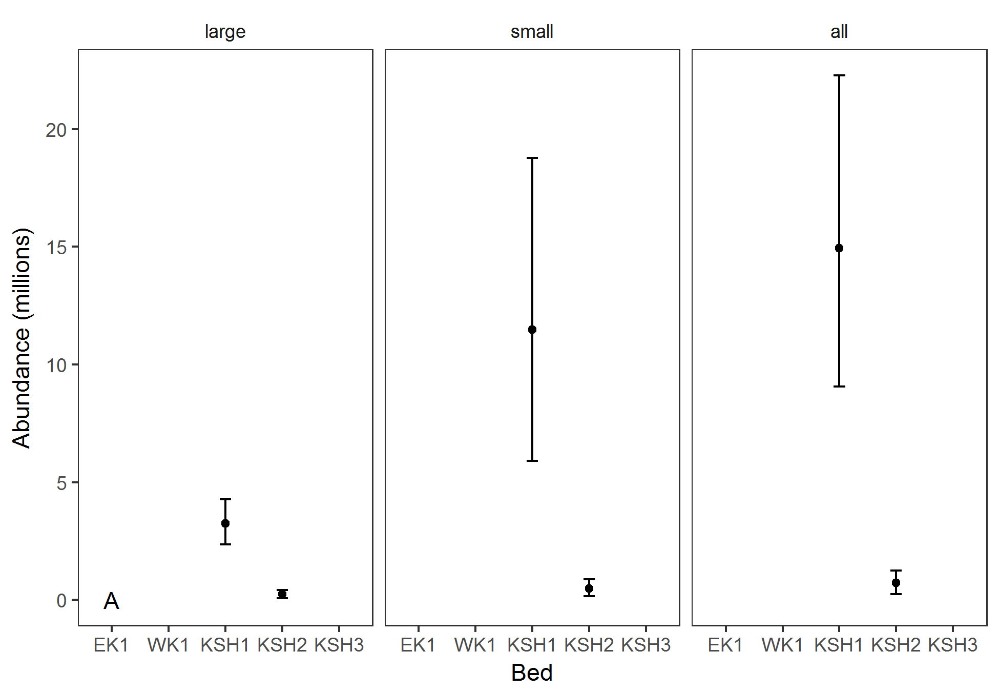
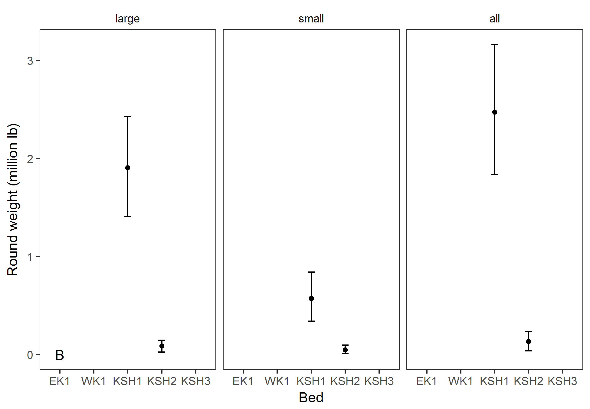
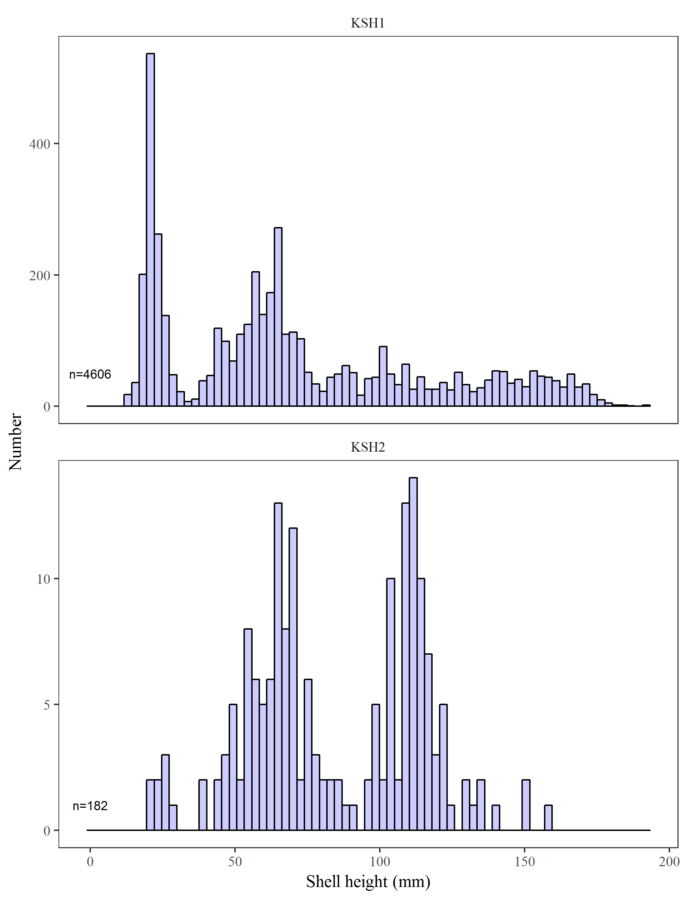
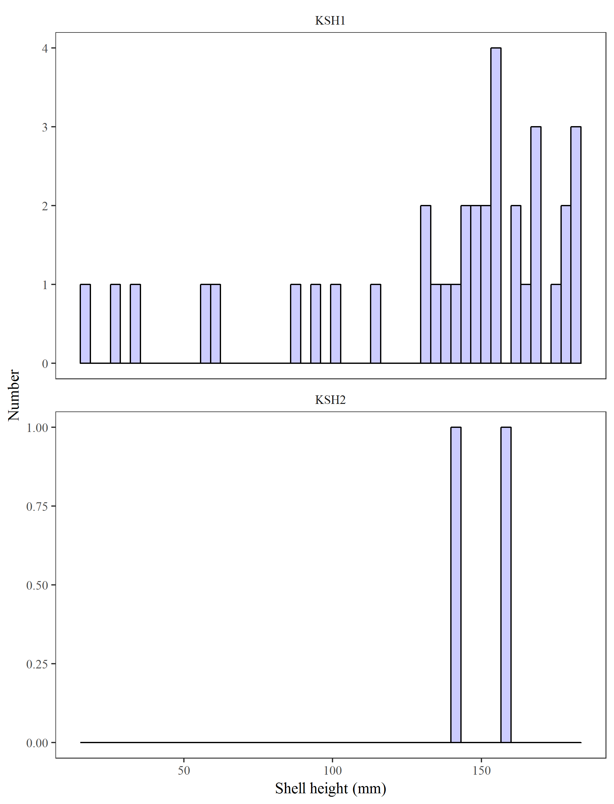
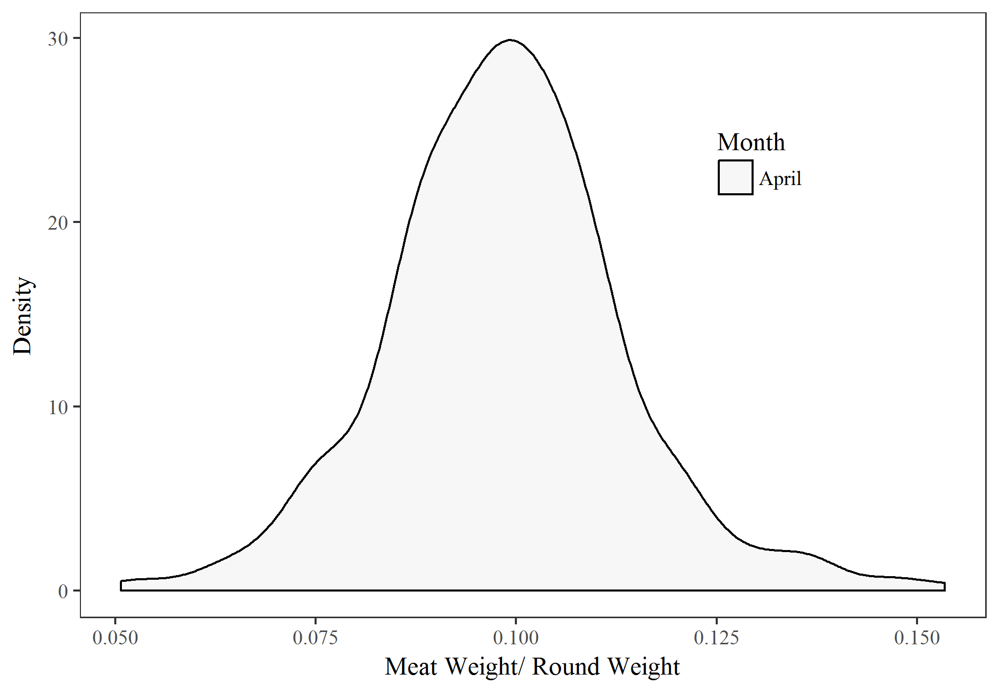

```{r, echo=FALSE, message=FALSE, warning=F}
library(knitr)
library(tidyverse)
options(scipen=9999) # remove scientific notation

knitr::opts_chunk$set(echo = FALSE, message=F, warning=F)
```
#ABSTRACT  

#INTRODUCTION

Weathervane scallops, Patinopecten caurinus, are distributed in the northeast Pacific Ocean from Pt. Reyes, California north to the Pribilof Islands in the Bering Sea, and west to the Aleutian Islands, and occur from the intertidal to 300 m (Foster 1991). Scallops are a long-lived species, attaining ages between 20 and 28 years in Alaska waters (Hennick 1973, Bechtol et al. (2009)). Densities that support commercial harvest typically occur between 45 and 130 m on discrete aggregations (or beds) (Kruse et al. 2005), and in a wide variety of habitats ranging from rock and gravel to silt and mud (Hennick 1973). Scallop beds are typically elongated or elliptical in shape and oriented in the direction of mean current flow (Kruse et al. 2000).

In Alaska, prior to 2016 dredge based fishery-independent surveys had been restricted to the Kayak Island and Cook Inlet areas. Initial surveys were conducted for Kamishak Bay and Kayak Island in 1984 and 1996, respectively (Hammarstrom and Merritt 1985, Bechtol et al. (2003)), and have been conducted biennially since 1996 (Gustafson and Goldman 2012). These surveys have enabled the department to (1) delineate the primary scallop beds; (2) estimate scallop abundance and biomass within these beds; (3) define bed composition through age and shell height data; and (4) estimate bycatch rates of non-target species, particularly Tanner crab. Fishery managers have used the results of these surveys to set guideline harvest limits (GHLs) and manage the commercial scallop fishery in the Cook Inlet and Prince William Sound registration areas. All other management areas in the state are reliant on fishery-dependent data gathered from the statewide scallop observer program to inform management decisions (NPFMC 2015).

In the spring of 2016 a program of expansion of the dredge based fishery-independent surveys was implemented (Smith et al 2016). The spring 2016 survey was scheduled to include the Kayak Island area, portions of the northern Yakutat area, and Shelikof Straight. Due to weather the northern Yakutat portion was not surveyed. In addition the Shelikof survey was truncated due to the planned survey vessel breaking down during the survey in May. A contracted commercial scallop vessel was used to complete the survey in July. Future survey plans included resurveying Shelikof Strait in 2017, and the remainder of Yakutat in 2018. 

# STUDY SITE
### The Kodiak Shelikof study area


Figure 1.- Shelikof Survey area showing location of the three beds Shelikof 1 (KSH1), Shelikof 2 (KSH2), and Shelikof 3 (KSH3). Red lines show the tow track of stations sampled in May. Black lines show the tow track of stations sampled in July.

###The Kayak Island study area

The Kayak Island study area is located near the southern end of Kayak Island in the Gulf of Alaska (Figure 2). This area is subject to severe weather conditions and large ocean swells. Coastal currents primarily run westerly as part of a counter-clockwise gyre in the northern Gulf of Alaska, and maximum tidal exchanges are typically less than 5 m (16.5 ft). Bottom substrate in the study area is primarily sand and pebbles with some rock and mud; rocky reefs are present near Cape St. Elias. Mud and glacial flour are common in the nearshore marine waters as outfall from glacial rivers located east of Kayak Island. Depth contours run from southwest to northeast, approximately parallel to the Kayak Island shoreline. Bottom depths in the scallop beds gradually slope from approximately 55 m (30 fathoms) in the northwest to over 110 m (60 fathoms) in the southeast.


Figure 2.-Kayak Island survey area area showing location of the two beds East Kayak 1 (EK1), and West Kayak 1 (WK1). Red lines show the tow track of stations sampled in May. 


#OBJECTIVES  
Primary:  

 1. Estimate catch rates and abundance of scallops by survey area with a coefficient of variation (CV) $\leq$ 20%.
 2. Collection of biological data (e.g., shell height, meat weight, age) for estimation of growth, mortality, and biomass.  

Secondary:  

 1. Record incidental catch (numbers and weight) of commercially important species and scallop predators.
 
Tertiary:  

 1. Address particular area management concerns.
 2. Special short term projects.
 
 
# METHODS  

## DREDGE SURVEY

Survey design and implementation, as well as sample collection procedures are detailed in the statewide scallop survey operational plan [@Smith2016].  

## STOCK ASSESSMENT AND QUOTA CALCULATIONS 
Scallop samples were analyzed for each survey area (bed) and categorized by size-class, large ($\geq$ 100 mm) and small (< 100 mm). Scallop abundance estimations were based upon area-swept calculations. The scallop density $d_i$ was calculated as:

$$d_i=\frac{c_i}{a_i},$$  
where  
$$a_i=l_i\cdot dw\cdot Q,$$  
and  
$$\bar d = \frac{1}{s}\sum_{i=1}^{s} d_i.$$

$c_i$ = the catch of a species, either as abundance or weight, in sample haul *i*,  
$a_i$ = the nmi^2^ sampled in haul *i*,  
$l_i$ = the nautical miles towed for sample haul *i*,  
*dw* = the dredge width in nmi,   
*Q* = dredge efficency, and   
*s* = the number of stations sampled.  

A preliminary *Q* of 0.83 calculated from the Kayak Island beds in 2004 [@Gustafson2012] was used in lieu of bed specific efficiencies. 
Density variance was calculated using a nonparametric bootstrap resampling procedure with replacement. 
Bootstrap percentile intervals were used to estimate 95% confidence intervals.  

An estimate of the surveyed population abundance $\hat{N}$ was calculated by expanding $\bar{d}$ over the defined bed area *A* encompassing all grid cells as: 

$$
\hat{N}=A\bar{d}.
$$

Variance and confidence intervals for the surveyed population $\hat{N}$ were estimated using a nonparametric bootstrap procedure.  

An estimate of the surveyed population round weight (lb) $\hat{RW}$ was calculated in the same manner as the abundance estimates.  

Avaiable meat weight biomass (lb) was calculated for each bed using two methods. 
Both methods use the meat/round weight ratio calculated from a subsample of 10 large individuals for each tow (where available).  
For every individual the meat weight ratio was calculated as: 
$$
r = \frac{MW (g)}{RW (g)}
$$
A nonparametric bootstrap procedure was used to estimate the mean ratio $\bar r$, variance, and percentile confidence intervals for each bed.  
The first meat weight estimation method was calculated using the estimated abundance $\hat{N}$ in each bed and the mean individual round weight $\bar{RW}$ per bed:
$$
MW_1 = \hat{N}\bar r\bar {RW}
$$
The second meat weight estimation method applied the $\bar r$ to the estimated round weight $\hat{RW}$(lb) of large scallops by bed. The round weight of large scallops by bed was calculated using the average density of scallop round weight by bed multipled by the area of each bed (see above, Table 3):
$$
MW_2 = \hat{RW}\bar r
$$
Projection intervals for the meat weight (lb) estimates were calculated from the nonparametric bootstraps performed for the abundance estimates (both $\hat{N}$ and $\hat{RW}$) and the mean ratio $\bar r$.  

A Guideline harvest level (GHL) was calculated based upon 5% and 10% population exploitation levels. 

Graphical representations of biological data are presented for evaluation and tables are presented for monitoring biological characteristics of interest (e.g., maturity stage, percent of shell with mud blisters). Histograms of scallop shell heights have been expanded to reflect the measured size distribution to the total number caught by tow.

#RESULTS  

## Sampling

```{r}
#pull in the number of tows and raw catch data
samples <- read_csv('../output/samples.csv')
raw <- read_csv('../output/catch.table.csv')

meat.wts <- read.csv('../output/meat.wts.csv')
```

**Discussion of vessel break down and change out** 

### Shelikof Area 
A total of
`r samples %>% filter(Bed=='KSH1'| Bed=='KSH2'|Bed=='KSH3') %>% summarise(n=sum(n))`
successful 1 nmi dredge tows were conducted during the 2016 Shelikof area scallop survey
`r filter(samples, Bed=='KSH1')$n` in bed 1,
`r filter(samples, Bed=='KSH2')$n` in bed 2, and
`r filter(samples, Bed=='KSH3')$n` in bed 3 (Figure 1).
There were a total of 
`r raw %>% filter(Bed=='KSH1'| Bed=='KSH2'|Bed=='KSH3') %>% summarise(sum(large.c + small.c))%>% prettyNum(digits=4, big.mark=",")`
scallops sampled, weighing 
`r raw %>% filter(Bed=='KSH1'| Bed=='KSH2'|Bed=='KSH3') %>% summarise(sum(large.kg + small.kg))%>% prettyNum(digits=4, big.mark=",")`
kg (`r raw %>% filter(Bed=='KSH1'| Bed=='KSH2'|Bed=='KSH3') %>% summarise(sum(large.lb + small.lb)) %>% prettyNum(digits=4, big.mark=",")` lb). 
Catch abundance ranged from 
`r raw %>% filter(Bed=='KSH1'| Bed=='KSH2'|Bed=='KSH3') %>% summarise(min(min.l))` to 
`r raw %>% filter(Bed=='KSH1'| Bed=='KSH2'|Bed=='KSH3') %>% summarise(max(max.l))` for large scallops/nmi and
`r raw %>% filter(Bed=='KSH1'| Bed=='KSH2'|Bed=='KSH3') %>% summarise(min(min.s))` to 
`r raw %>% filter(Bed=='KSH1'| Bed=='KSH2'|Bed=='KSH3') %>% summarise(max(max.s))` for small scallops/nmi.

### Kayak Island 
A total of `r filter(samples, Bed=='EK1')$n + filter(samples, Bed=='WK1')$n`
successful 1 nmi dredge tows were conducted during the 2016 Kayak Island scallop survey
`r filter(samples, Bed=='EK1')$n` in the east bed and
`r filter(samples, Bed=='WK1')$n` in the west bed (Figure 2).
There were a total of 
`r raw %>% filter(Bed=='EK1') %>% summarise(large.c + small.c)`
scallops sampled, weighing
`r raw %>% filter(Bed=='EK1') %>% summarise(large.kg + small.kg)%>% prettyNum(digits=4, big.mark=",")`
kg (`r raw %>% filter(Bed=='EK1') %>% summarise(large.lb + small.lb) %>% prettyNum(digits=4, big.mark=",")` lb). 
Catch abundance ranged from 
`r raw %>% filter(Bed=='EK1'| Bed=='WK1') %>% summarise(min(min.l))` to 
`r raw %>% filter(Bed=='EK1'| Bed=='WK1') %>% summarise(max(max.l))` for large scallops/nmi and
`r raw %>% filter(Bed=='EK1'| Bed=='WK1') %>% summarise(min(min.s))` to 
`r raw %>% filter(Bed=='EK1'| Bed=='WK1') %>% summarise(max(max.s))` for small scallops/nmi.

## Scallop density and abundance  

The average scallop density and abundance by bed were estimated along with their respective confidence intervals, and coefficient of variation (CV) (Tables 1, 2, and 3). 
Scallop abundance calculations were performed for both size classes (small and large) and for all scallop combined (all). 

The Kodiak District Shelikof 1 bed was within the target CV when examined by number of scallops, no other area met the target CV (Table 1). Scallop density and abundance were highest for the Western Kayak Island bed (Table 2), though round weights were greatest in the Kodiak District Shelikof 1 bed (Table 3). 
The CV for round weight estimates was similar to the abundance based CV for all beds (Tables 1 and 3).

The meat weight to round weight ratio was between `r prettyNum(min(meat.wts$ratio_bar), digits=2)` and `r prettyNum(max(meat.wts$ratio_bar), digits=2)`, with little variability found within beds (Table 4). 
Proposed GHLs were generally similar between the two meat weight estimates (Tables 5 & 6). THough the estimates based upon weights, as opposed to numbers, have lower overall variability.


```{r}
a <- read_csv('../output/N_summary.csv')
a %>% filter(Bed=='WK1', variable=='all') -> wk1
awl <- read_csv('../data/awl_2016_161027.csv')
```
  

###Scallop height distribution by bed
Histograms of scallop height by bed (Figure 5) show dominant size clasess that vary by bed. The smallest scallop measured had a shell height of `r min(awl$SHELL_HEIGHT_MM,na.rm=T)` mm and the largest was `r max(awl$SHELL_HEIGHT_MM,na.rm=T)` mm. The EK1 bed had very few small scallops sampled, and the size structure was narrowly grouped for large scallops. The WK1 bed scallops were generally smaller than those sampled from EK1, though an evident size structure is observed that includes a substantial number of small scallops. The KSH1 bed has a widely dispersed size structure with many scallops observed in the smallest size mode, as well as a second mode of large scallops. THe KSH2 and KSH3 beds have more small scallops present, though the KSH3 bed had few scallops measured.  

###Clappers

Work in progress 

#DISCUSSION  
The primary objective of this survey was to estimate scallop abundance by survey area with a coefficient of variation (CV) $\leq$ 20%.  From the results reported in Table 1, only EK1 and KSH1 were near to that level.  Additional sampling would be recommended to achieve a smaller CV in the remaining three survey areas (KSH2, KSH3, and WK1).  A power analysis can be performed prior to future surveys of these areas to determine the desired increased sample rate to reduce the CV. 

The estimated EK1 bed abundance is substantially lower than has previously been estimated from 1996-2010, though has a similar CV [@Gustafson2012]; Table 2). Coupled with the extremely low number of small scallops observed during the sampling the EK1 bed remains a concern. The WK1 bed was within the range of historic abundance estimates [@Gustafson2012; Table 2] though the CV was higher. This high CV likley relates to a reduced sampling schedule (30% vs 50% of the bed sampled) and a highly patchy distribution observed in the samples. It is recommended that future surveys include 35% of this bed as a minimum sample size. There are no previous surveys with which to compare KSH abundance estimates, however the historic GHLs from this area have been high [@NPFMC2015]. The abundance and weights estimates (Tables 2 and 3) of large scallops do not appear well suited to supporting harvest at the historic GHLs.

The subsample of scallops collected for more detailed biological data was set at a desired random subsample of 40 individuals.  Ten of these (large only) were further sampled to determine a meat weight to round weight ratio. A goodness-of-fit test (K-S test) was performed for each tow to confirm that the 10 random samples were representative of the 40 subsampled (results not shown). Using only the tows that had adequate sampling of large scallops (n>11) these 10 samples represented the entire subsample well (90% of the time). This analysis indicates that the sample design proposed in the operational plan [@Smith2016] is reasonable for the analyses examined in this study.

Amendment 6 of the scallop Fishery Management Plan (FMP) established an overfishing control rule of *F*=0.13, where *F* is the instantaneous rate of fishing mortality. An *F* of this level corresponds to a maximum of a 12% annual exploitation rate. Therefore a target annual exploitation should be <12%, it has been proposed by @Barnhart2003 that harvesting at a 10% annual exploitation rate is appropriate for maintaining a precautionary approach and is "consistent with the NMFS technical guidance on implementing National Standard 1". The Central Region has set their GHLs based upon a 5% exploitation rate [@Gustafson2012]. Herein GHLs based upon both round weight and abundance estimates are presented at 5% and 10% exploitation rates, as well as the lower and upper projection intervals. The authors recommend that managers utilize the range of estimates (narrower ranges are better) as well as the size structure information when determining the appropriate GHLs.


# ACKNOWLEDGEMENTS

# TABLES

``````{r, echo=F, message=F, warning=F}
a <- read.csv('../output/N_summary.csv')
b <- read.csv('../output/numbers_original.csv')

column_names = c('Bed', 'Area (nmi)', 'Sample', 'N (numbers)', 'CV')
b %>%
  group_by(year, Bed) %>%
  summarise (sample_size = mean(n), area = mean(area)) %>% 
   left_join(a) %>% 
  filter(variable == 'large')%>%
		mutate(id = c(1,3,4,5,2)) %>% 
	arrange(id) %>% 
  mutate(dbar = round(dbar_b), cv = round(cv), N = round(N_b), CV = round(cvN), size.class = variable) %>% ungroup %>% 
   dplyr::select(Bed, area, sample_size, N, CV, -year) %>%  
   mutate_each(funs(prettyNum(., big.mark=","))) %>% 
   kable( ,col.names = column_names, caption = "Estimates of large scallop abundance and CV by bed.")
```

``````{r, echo=F, message=F, warning=F}
# totals for KSH beds
column_names = c('District', 'N (numbers)', 'CV')
KSH <- c("KSH1", "KSH2", "KSH3")
a %>%
  mutate (District = ifelse(Bed == "EK1", "EK1", ifelse(Bed == "WK1", "WK1", ifelse(Bed %in% KSH, "KSH", "NA")))) %>% 
  group_by(year, District) %>%
   filter(variable == 'large')%>%
  summarise(N = sum(N_b), CV = mean(cvN)) %>% 
  ungroup %>% 
   dplyr::select(District, N, CV) %>%  
   mutate_each(funs(prettyNum(., big.mark=","))) %>% 
   kable( ,col.names = column_names, caption = "Estimates of large scallop abundance and CV by District.")
```


```{r t.N_dbar, echo=F, message=F, warning=F}

column_names = c('Bed', 'Size class', 'N (indiv scallops)', 'LL', 'UL', 'Density (scallop/nmi)', 'D LL','D UL' )

a %>% 
   mutate(N=round(N_b),
          N_UL=round(ulN),
          N_LL=round(llN),
          dbar=round(dbar_b),
          dbar_UL=round(uldbar),
          dbar_LL=round(lldbar)) %>% 
	mutate(id = c(rep(1,3),rep(3,3),rep(4,3),rep(5,3),rep(2,3))) %>% 
	arrange(id, variable) %>% 
   select(Bed, variable, N,N_LL,N_UL,dbar,dbar_LL,dbar_UL) %>% 
   mutate_each(funs(prettyNum(., big.mark=","))) %>%  mutate_each(funs(prettyNum(., big.mark=","))) %>%  
   kable(col.names = column_names, caption = "Estimates of abundance and density with 95% bootstrap confidence intervals")
```


```{r, echo=F, message=F, warning=F}
f <- read.csv('../output/weights_summary.csv')
column_names = c('Bed', 'Weight', 'LL', 'UL', 'CV')
f %>% filter(variable == 'large') %>% 
   mutate(RW=round(Weight),RW_UL=round(ulW),RW_LL=round(llW), CV = round(cvW)) %>% 
	mutate(id = c(1,3,4,5,2)) %>% 
	arrange(id) %>%  
   select(Bed, RW, RW_LL, RW_UL, CV, -id) %>%  
   mutate_each(funs(prettyNum(., big.mark=","))) %>% 
   kable(col.names = column_names, caption = "Estimates of round weight (lb) with 95% bootstrap confidence intervals for large scallops by bed.")

```


```{r, echo=F, message=F, warning=F}
column_names = c('Bed', 'Ratio', 'LL', 'UL')

meat.wts %>% mutate(Ratio=round(ratio_bar, digits=3),
             LL=round(ll, digits=4),
             UL=round(ul, digits=4)) %>% mutate(id = c(1,3,4,5,2)) %>% 
	arrange(id) %>% 
   select(Bed,Ratio, LL, UL, -id) %>%
   mutate_each(funs(prettyNum(., big.mark=","))) %>% kable(caption= 'Meat weight to round weight ratio (lb) by bed from individual scallops with 95% bootstrap confidence intervals.')
```

```{r, echo=F, message=F, warning=F}
options(digits=2)
a <- read.csv('../output/number_GHL.csv')
column_names = c('Bed', 'GHL 5%', 'LL 5%', 'UL 5%','GHL 10%', 'LL 10%', 'UL 10%')
a %>% 
	mutate(id = c(1,3,4,5,2)) %>% 
	arrange(id) %>% 
	dplyr::select(Bed, GHL.05, lowGHL.05, highGHL.05, GHL.10, lowGHL.10, highGHL.10) %>% 
	mutate_each(funs(prettyNum(., big.mark=","))) %>% 
	kable(col.names = column_names,caption= 'Meat weight GHL (lb) estimates by bed, using meat weight estimate 1, for a 5 and 10 % exploitation rate.')

```


```{r, echo=F, message=F, warning=F}
options(digits=2)
a <- read.csv('../output/weight_GHL.csv')
column_names = c('Bed', 'GHL 5%', 'LL 5%', 'UL 5%','GHL 10%', 'LL 10%', 'UL 10%')
a %>% 
	mutate(id = c(1,3,4,5,2)) %>% 
	arrange(id) %>% 
	dplyr::select(Bed, GHL.05, lowGHL.05, highGHL.05, GHL.10, lowGHL.10, highGHL.10) %>% 
	mutate_each(funs(prettyNum(., big.mark=","))) %>% 
	kable(col.names = column_names,caption= 'Meat weight GHL (lb) estimates by bed, using meat weight estimate 2, for a 5 and 10 % exploitation rate.')

```

```{r}
worm <- read_csv('../output/worm.csv')

kable(worm, caption='The percent of shells with evidence of boring worms by bed.')
```

```{r}
gonad <- read_csv('../output/gonad.csv')

kable(gonad, caption='Gonad developement stage of scallops by bed and month.')
```

```{r}
blist <- read_csv('../output/blist.csv')

kable(blist, caption='The percent of scallops with mud blisters by bed.')
```

```{r}
weak <- read_csv('../output/weak.csv')

kable(weak, caption='Observed scallop meat condition, an indication of "weak meats" by bed.')
```


#FIGURES


###Clappers
**Table 6:** Preliminary estimates of abundance (by weight) and percent clappers by bed. 
```{r}
options(digits=3)
 
g <- read.csv('../output/clapper.summary.csv')
column_names = c('Bed', 'Year', '% in numbers', '% in round weight')
g %>% mutate(id = c(1,3,4,5,2)) %>% 
	arrange(id) %>% select(Bed, year, percent_clap, percent_clap_wt) %>% kable(col.names = column_names,caption= 'Percent of clappers present in round weight and numbers by bed.')
```


#REFERENCES  

Something something











